# Installing contrail in VMM
This document provides information on how to install Contrail in the VMM environment.

## Topology
The logical topology of the testbed is as follows :
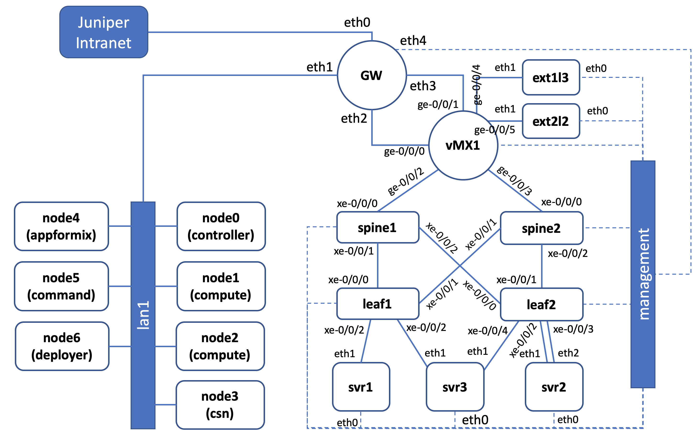

The devices/nodes in the topology are :
0: GW
    - gateway between juniper's intranet and testbed network
1. Contrail nodes 
    - node0 : Openstack/Contrail contoller
    - node1 : compute
    - node2 : compute
    - node3 : CSN (contrail service node)
    - node4 : Appformix
    - node5 : contrail command
    - node6 : deployer
2. DC Fabric
    - VMX : DCGW
    - spine1, spine2, leaf1, leaf2 : DC Fabric
3. Servers
    - svr1, svr2, svr3 : BMS in the DC Fabric
    - ext1l3 : External node connected through L3
    - ext2l2 : external node connected through L2

subnets in the testbed
- lan1 : 172.16.11.0/24
- vmxg0 (link between GW and VMX ) : 172.16.12.0/31
- vmxg1 (link between GW and VMX ) : 172.16.12.2/31
- management: 172.16.14.0/24

## Setup the testbed
1. Create yaml file for the lab topology, or you can use the following [lab.yaml](lab.yaml)
2. Create the topology using this [script](https://github.com/m1r24n/running_on_vmm) to create the configuration files and upload them into the VMM pod

3. Start the topology using the same script

4. Record the IP address of GW assigned by VMM

5. Wait for few minutes to allow the VMs to be up and running
6. SSH into GW and verify that all nodes are up and running

7. (optionally) install wireguard to have direct access to node from your workstation. Follow this [instruction](https://github.com/m1r24n/running_on_vmm/tree/master/install_wg_on_vmm) on how to install wireguard on VM inside the VMM.
8. Establish VPN connection from your workstation to GW

9. Test direct access into the nodes from your workstation


## Install configuration for junos devices
You can create your own configuration for the junos devices, or use the following example of [junos_config](junos_config/) for IP fabric configuration of the junos devices.

## Initial nodes configuration 
1. Access node6 (deployer node), and verify the following on node6
    - from node6, all the other node (node0 to node5) are accessible
    - file /etc/hosts has entries for all nodes and devices in the testbed, especially contrail nodes. If node6 doesn't have it, then copy the following into /etc/hosts
    ```
    127.0.0.1       localhost.localdomain localhost
	::1             localhost6.localdomain6 localhost6
	172.16.11.1     gw
	172.16.11.10    node0
	172.16.11.11    node1
	172.16.11.12    node2
	172.16.11.13    node3
	172.16.11.14    node4
	172.16.11.15    node5
	172.16.11.16    node6
	172.16.255.0    vmx
	172.16.255.1    spine1
	172.16.255.2    spine2
	172.16.255.3    spine3
	172.16.255.4    spine4
    ```
2. create ssh-key on node6

3. copy the ssh-key to node0 .. node5 to allow passwordless ssh access from node6 
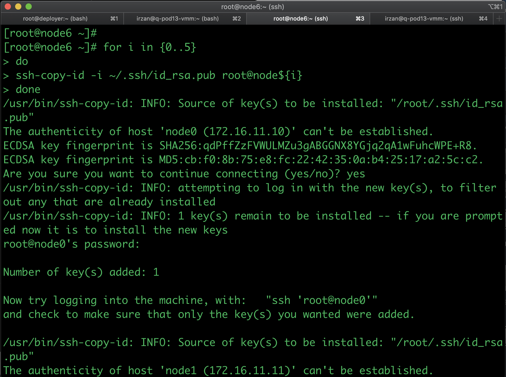
command to copy ssh-key

```
for i in {0..5}
do
ssh-copy-id -i ~/.ssh/id_rsa.pub root@node${i}
done
```

4. Copy file /etc/hosts to node0 .. node5
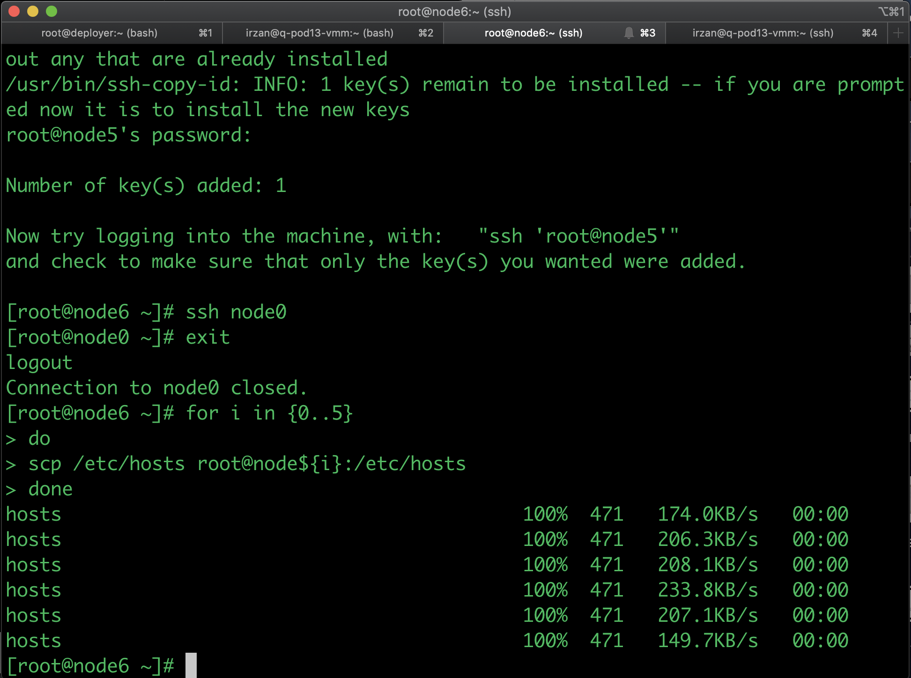
command to copy /etc/hosts

	```
	for i in {0..5}
	do
		scp /etc/hosts root@node${i}:/etc/hosts
	done 
	```
## Openstack and Contrail installation using ansible deployer
1. For contrail 1910, please follow the [manual](https://www.juniper.net/documentation/en_US/contrail19/topics/concept/install-contrail-ocata-kolla-50.html)

	The documentation mention that the ansible version required is 2.7.10. 
	but this version may not be available anymore from EPEL repository.

	To install ansible version 2.7.10, please use python pip, do not use yum.
		```
		yum -y install epel-release
		yum -y update
		yum install git python-pip
		pip install ansible==2.7.10
		yum -y remove PyYAML python-requests
		pip install PyYAML requests
		yum -y install sshpass
		```
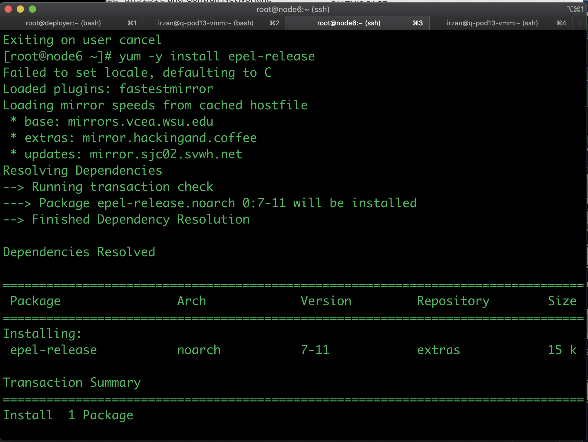
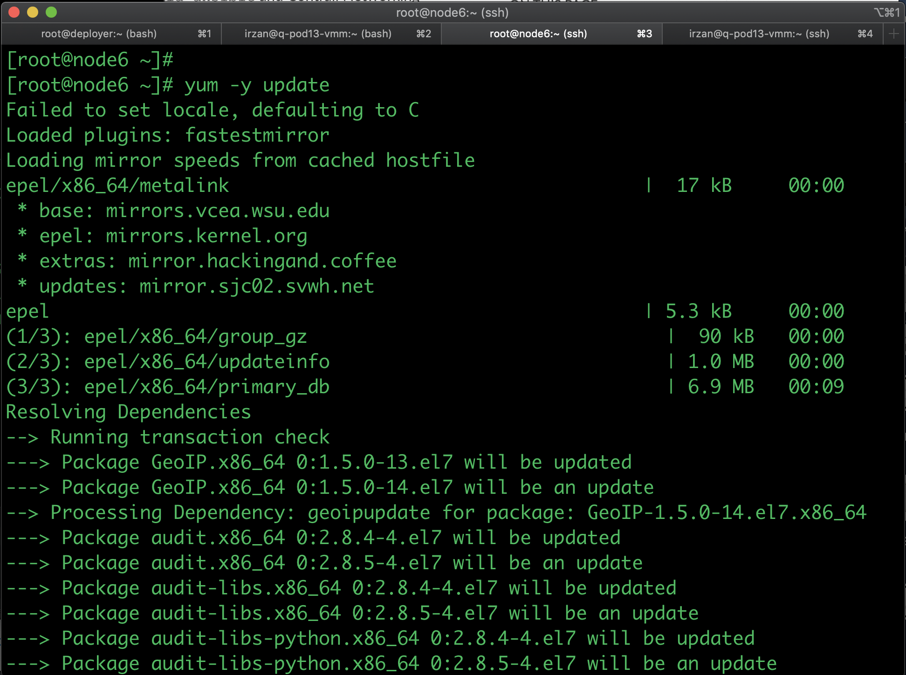
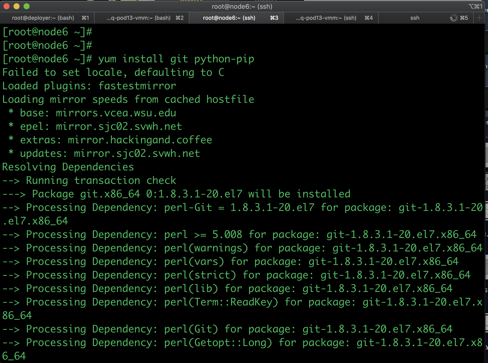
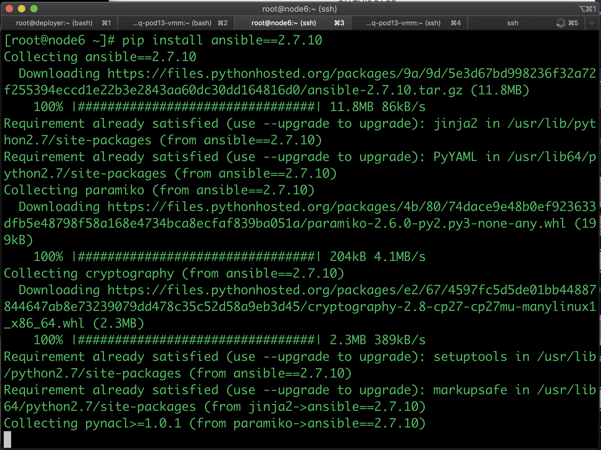
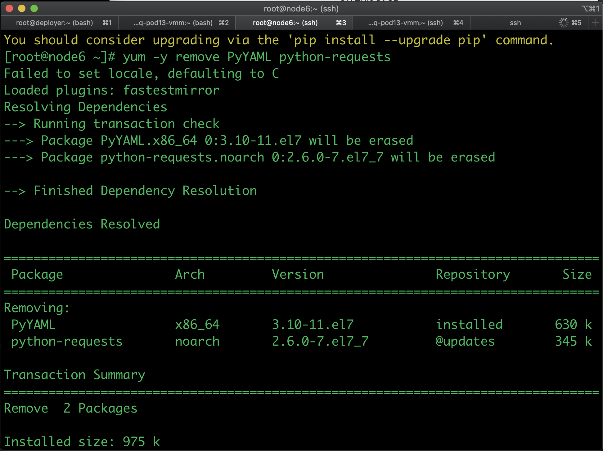
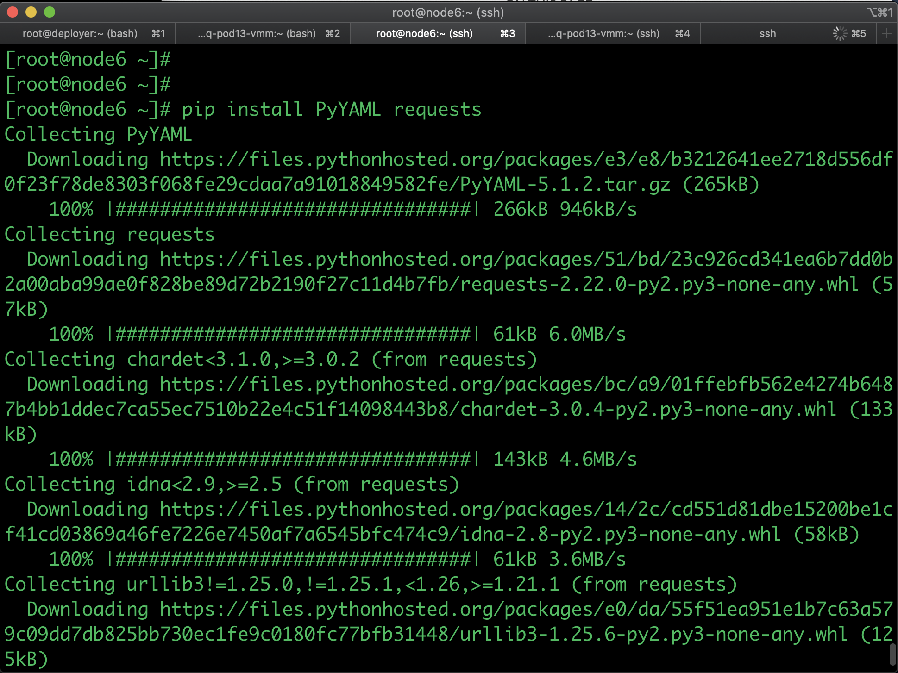

2. Upload the ansible deployer file into node6 and unzip the file
3. Upload this file [instances.yaml](instances.yaml) to node6, and put it inside directory `contrail-ansible-deployer/config
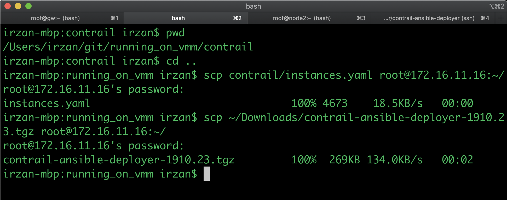
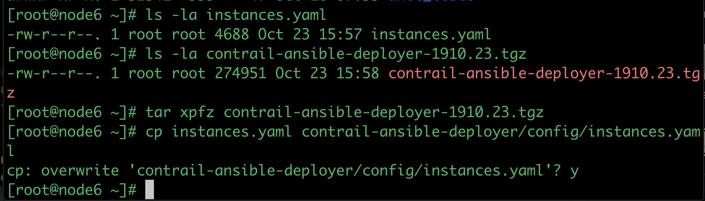

4. Get the vga_port of VM node6, and use this information (host and port number) to open VNC session to the console of node6 (using this method to run the playbooks, allow you to disconnect remote access session, and leave the playbook run until it finish). It may take 30 to 60 minutes to install.
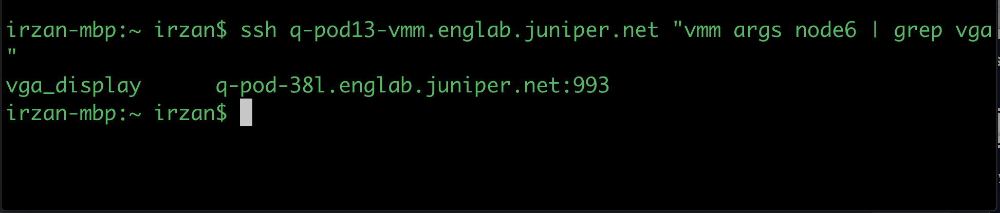

5. Enter contrail-ansible-deployer directory, and start the following command :
    - ansible-playbook -e orchestrator=openstack -i inventory/ playbooks/configure_instances.yml
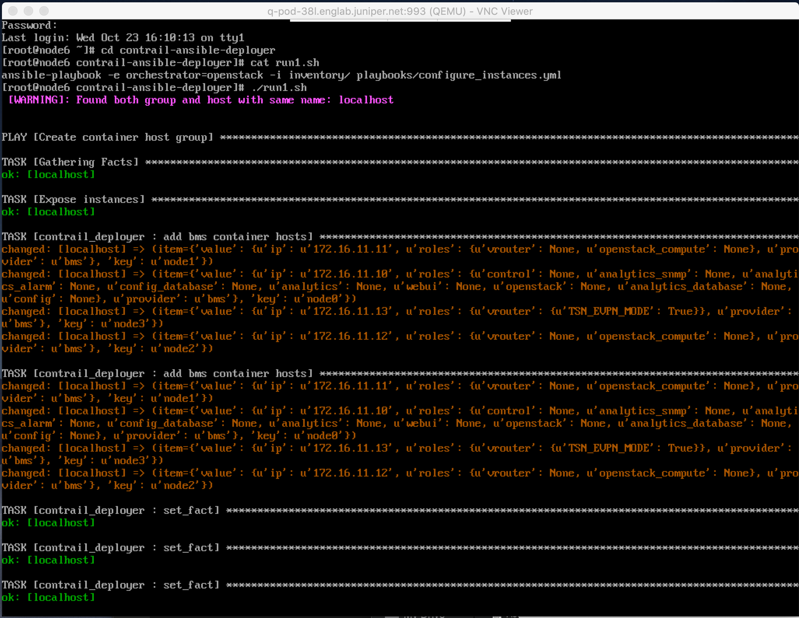
6. Run the following command :
    - ansible-playbook -i inventory/ playbooks/install_openstack.yml
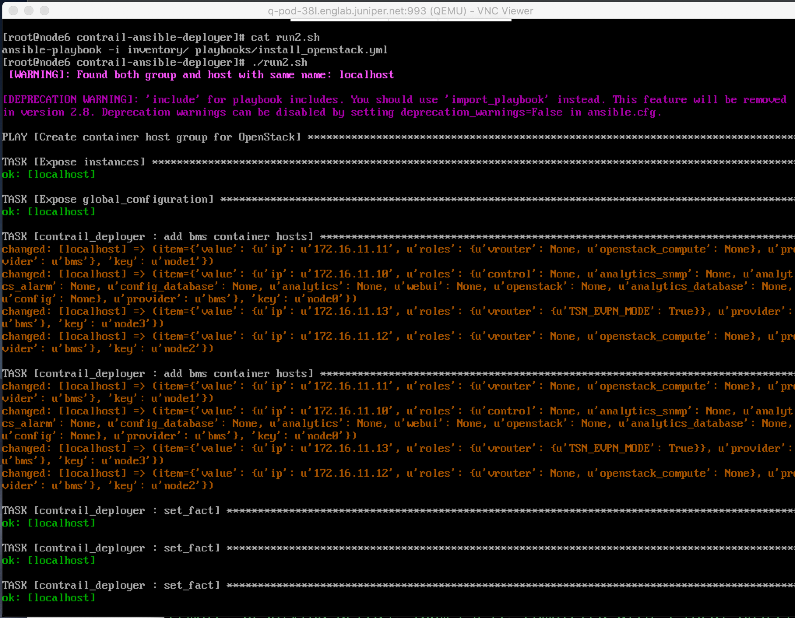
7. Run the following command :
    - ansible-playbook -e orchestrator=openstack -i inventory/ playbooks/install_contrail.yml
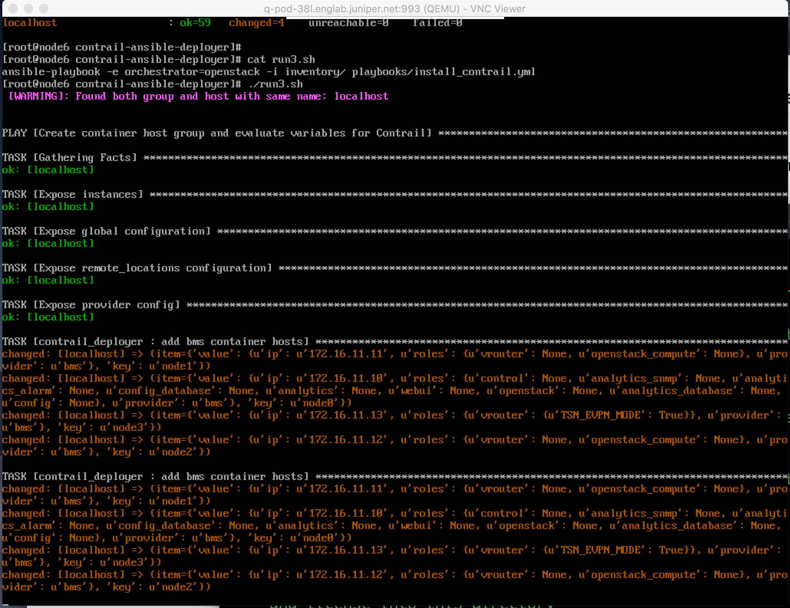


