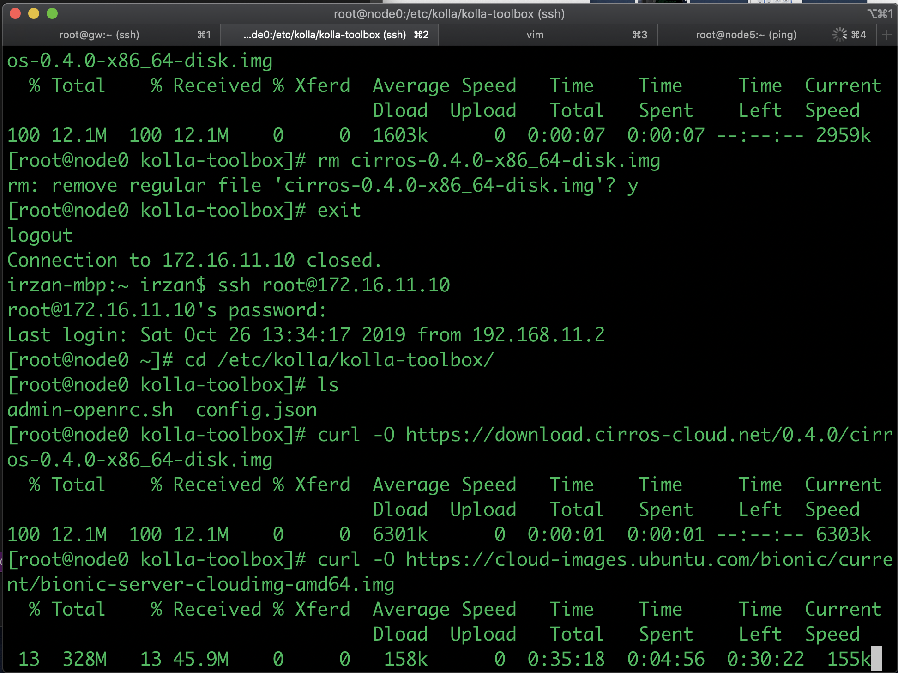
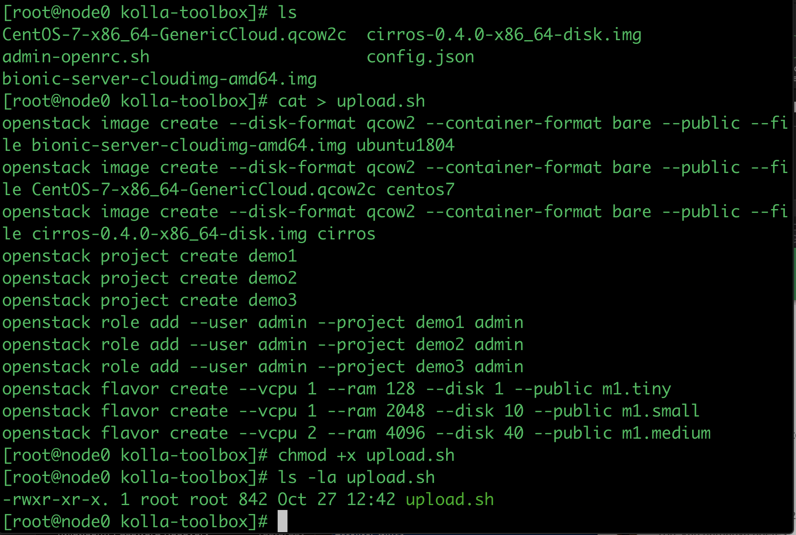
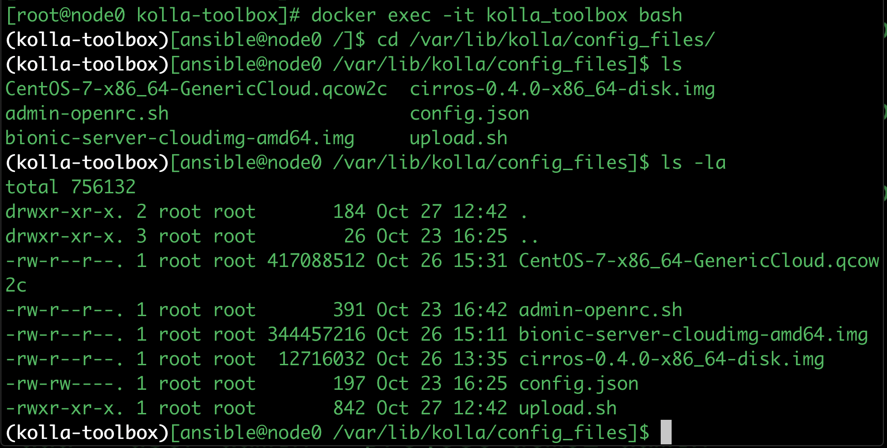
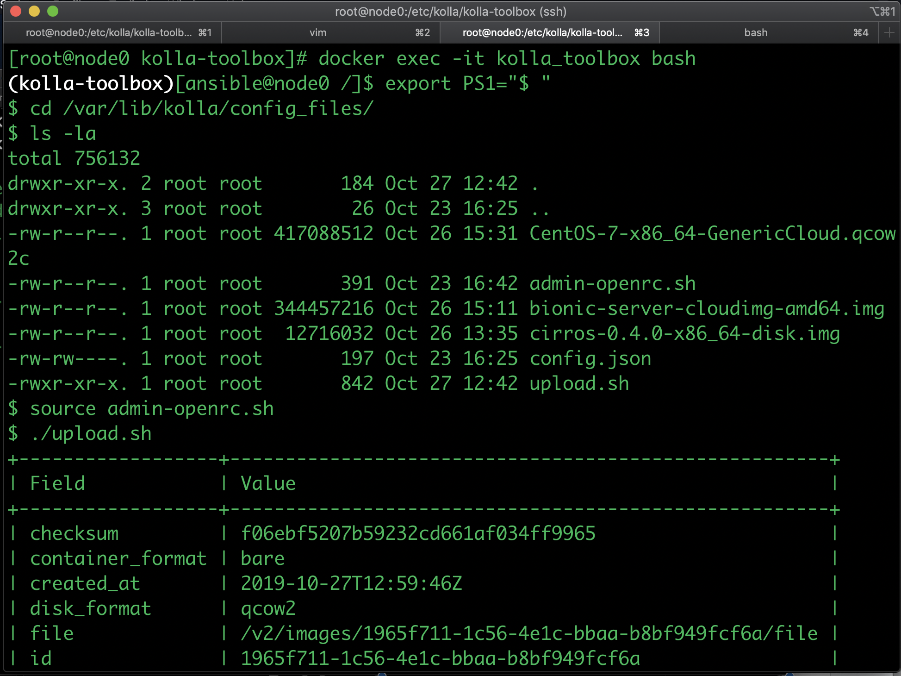
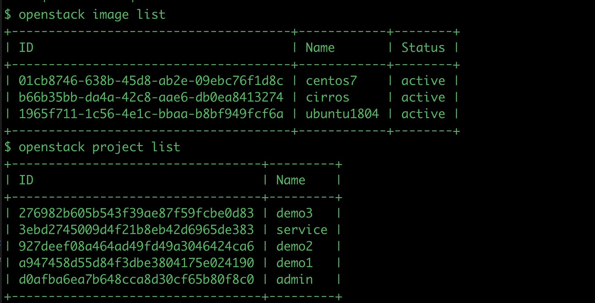
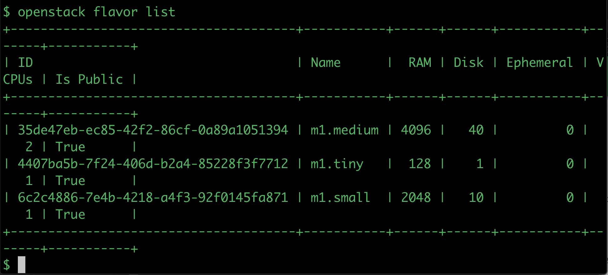

# Uploading image, create flavors and projects
In this exercise, the following tasks will be done
- using openstack cli to upload images, create flavors and projects 
- accessing the Dashboard (Openstack, Contrail, and Contrail command)

## Download the images
1. ssh into node0, and change directory to /etc/kolla/kolla-toolbox
2. download cloud images for the following image
    - cirros, https://download.cirros-cloud.net/0.4.0/cirros-0.4.0-x86_64-disk.img
    - ubuntu, https://cloud-images.ubuntu.com/bionic/current/bionic-server-cloudimg-amd64.img
    - centos, https://cloud.centos.org/centos/7/images/CentOS-7-x86_64-GenericCloud.qcow2c 

3. Create the following shell script (to upload image, create flavors and projects) and make the file executable
	```
	openstack image create --disk-format qcow2 --container-format bare --public --file bionic-server-cloudimg-amd64.img ubuntu1804
	openstack image create --disk-format qcow2 --container-format bare --public --file CentOS-7-x86_64-GenericCloud.qcow2c centos7
	openstack image create --disk-format qcow2 --container-format bare --public --file cirros-0.4.0-x86_64-disk.img cirros
	openstack project create demo1
	openstack project create demo2
	openstack project create demo3
	openstack role add --user admin --project demo1 admin
	openstack role add --user admin --project demo2 admin
	openstack role add --user admin --project demo3 admin
	openstack flavor create --vcpu 1 --ram 128 --disk 1 --public m1.tiny
	openstack flavor create --vcpu 1 --ram 2048 --disk 10 --public m1.small
	openstack flavor create --vcpu 2 --ram 4096 --disk 40 --public m1.medium

	```
    

4. Run `docker exec -it kolla_toolbox bash` to enter kolla-toolbox container, and change directory to /var/lib/kolla/config_files/
    
5. Source file `admin-openrc.sh` and execute script file that was created on step 3. The script will upload images into openstack, create projects and aassigns them to user admin, and create flavors
    
6. Verify that images has been uploaded, projecst and flavors has been created.
    
    
7. You can also access [Contrail command dashboard](https://172.16.11.15:9091), [openstack dashboard](http://172.16.11.10) and [Contrail Dashboard](http://172.16.11.10:8180)
