# Discovering DC Fabric
In this lab, the existing DC Fabric will be discovered by contrail networking.

Steps 
1. Access contrail command
2. Select menu `Infrastructure > Fabric and click `create`
3. Select `Existing Fabric` and click `Provision`
4. Enter the name of the fabric, for example `DC`
5. For device credentials use the following
    - username : admin
    - password : pass01
6. For `Management subnets` enter the following
    - 172.16.255.0/32
    - 172.16.255.1/32
    - 172.16.255.2/32
    - 172.16.255.3/32
    - 172.16.255.4/32
7. For `Loopback subnets` enter `172.16.255.0/24`
8. Click `Next` and wait until the discovery process is done
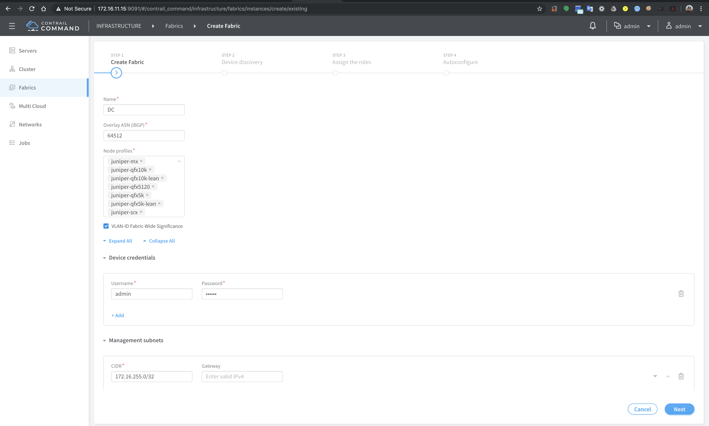
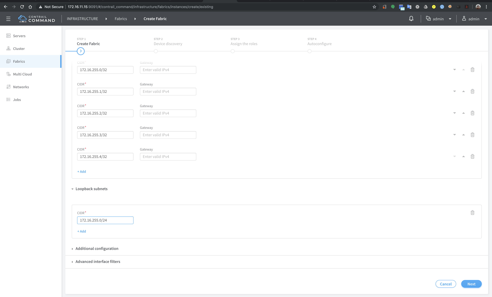
9. Open SSH session into node0, and run `tail -f /var/log/contrail/contrail-fabric-ansible-playbooks.log` to monitor the ansible playbook
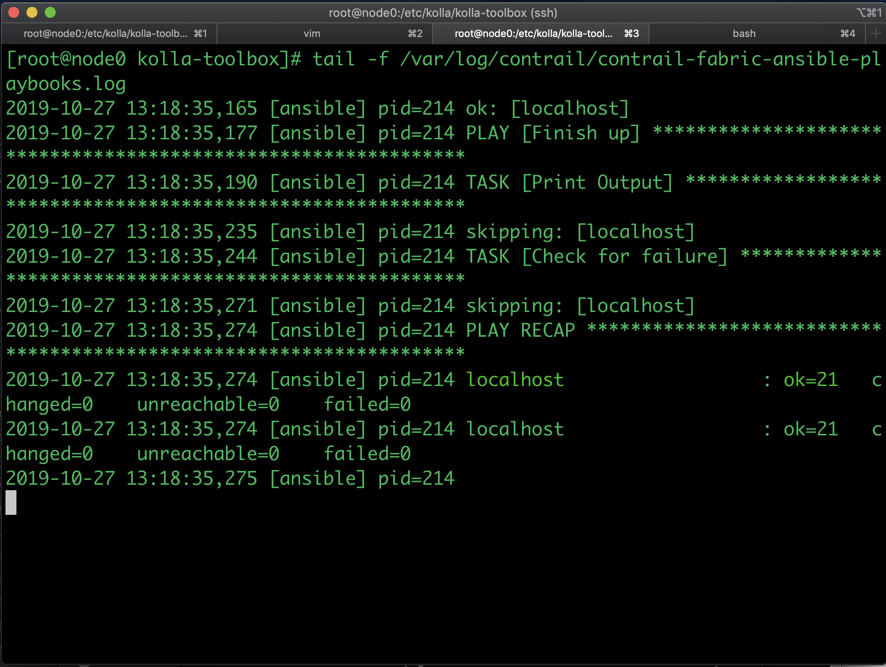
10. When the discovery is done, click `Next` to autoconfigure the role
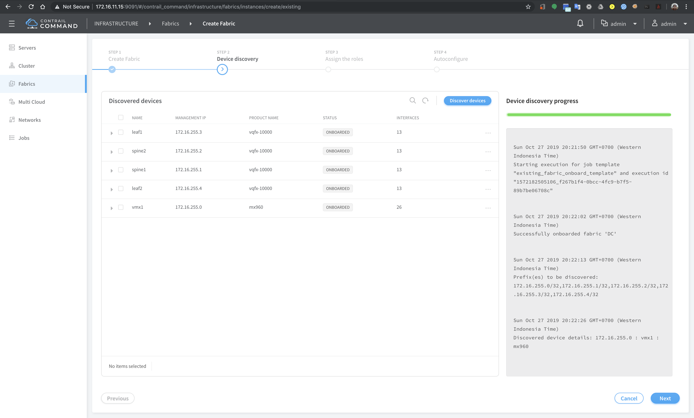
11. Configure leaf1 and leaf2 to `Physical Role` : `leaf` and `Routing Bridging Roles` : `CRB-Access`
12. Configure spine1 and spine2 to `Physical Role` : `spine` and `Routing Bridging Roles` : `CRB-Gateway, Route-Reflector, DC-Gateway`
13. Configure vmx1 to `Physical Role` : `spine` and `Routing Bridging Roles` : `DC-Gateway`
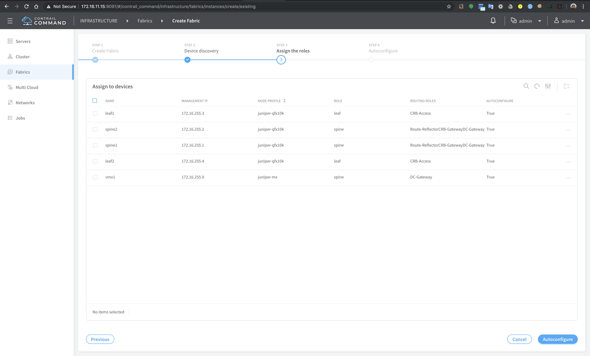
14. Click `Autoconfigure` and monitor the log file to verify that the autoconfigure process is done
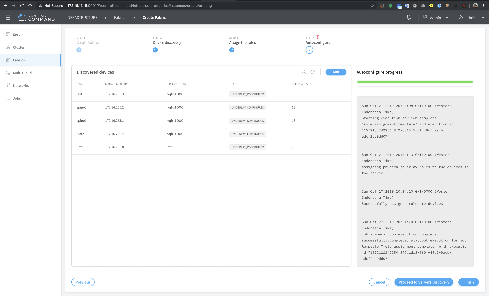
15. SSH into the devices to verify that the configuration has been pushed by contrail controller.
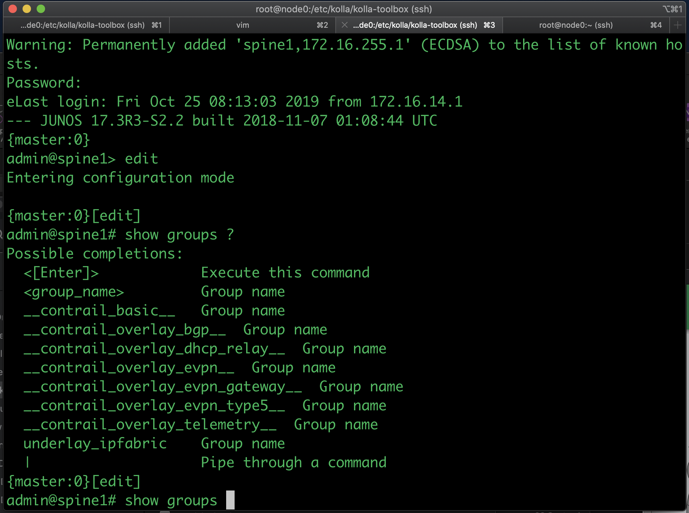
16. From the menu, select `Infrastructure` > `Fabric` > `DC`, edit `leaf1`, click `Associated Services Nodes` and assign `Virtual Router Type` to `contrail-service-node` and `Existing TSN` to `node3.testbed.com` and click `save`
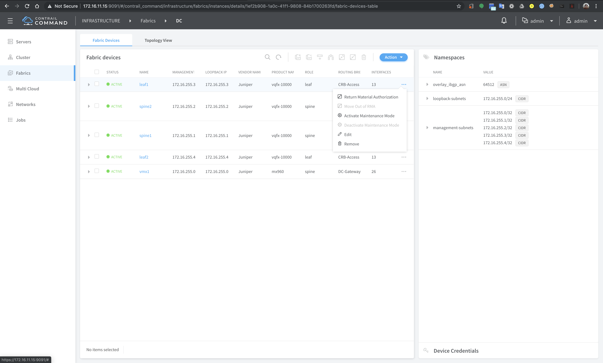
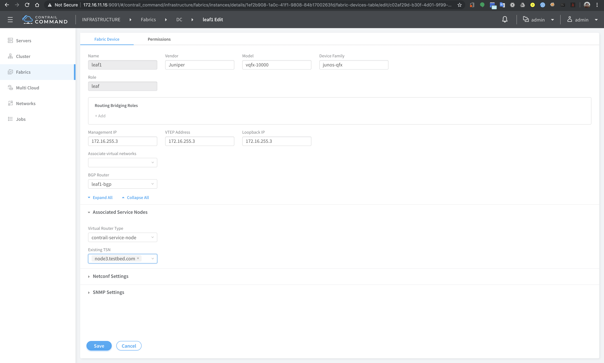
17. Repat step 16 for `leaf2`
18. From menu select `Infrastructure` > `Cluster` > `Advance options` > `Virtual Routers` and edit `Forwarding options` and change the encapsulation priority order to `VxLAN, MPLS over UDP, MPLS over GRE` and click `Save`
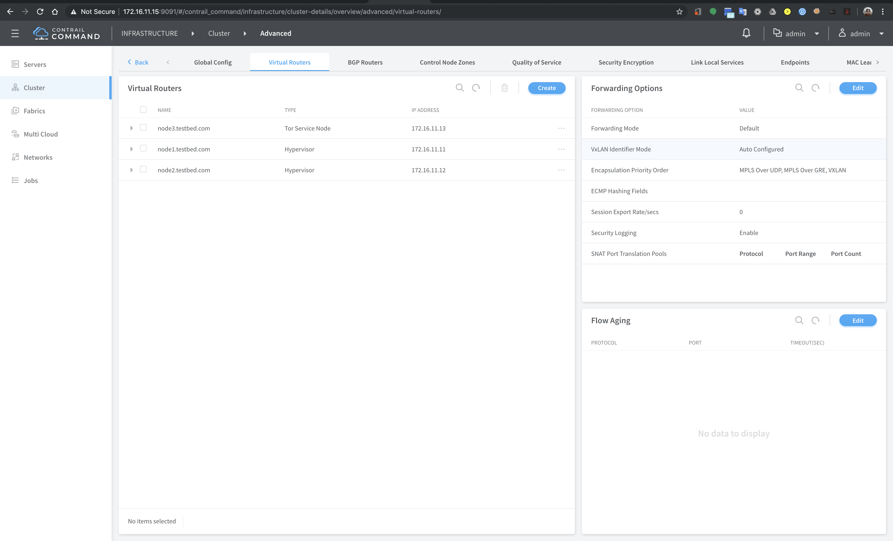
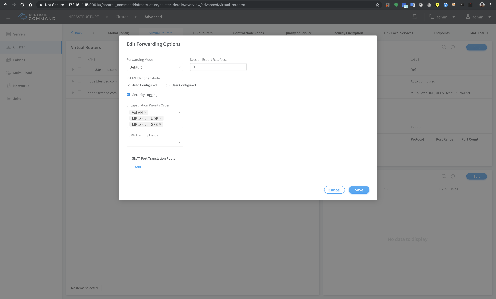
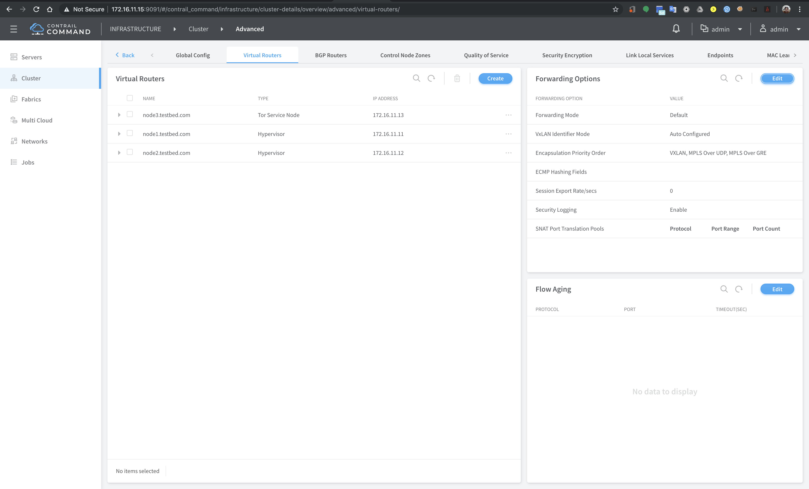
18. DC Fabric discovery process is done. The topology of the fabric can be displayed on topology view (the link between devices may take time to appear)
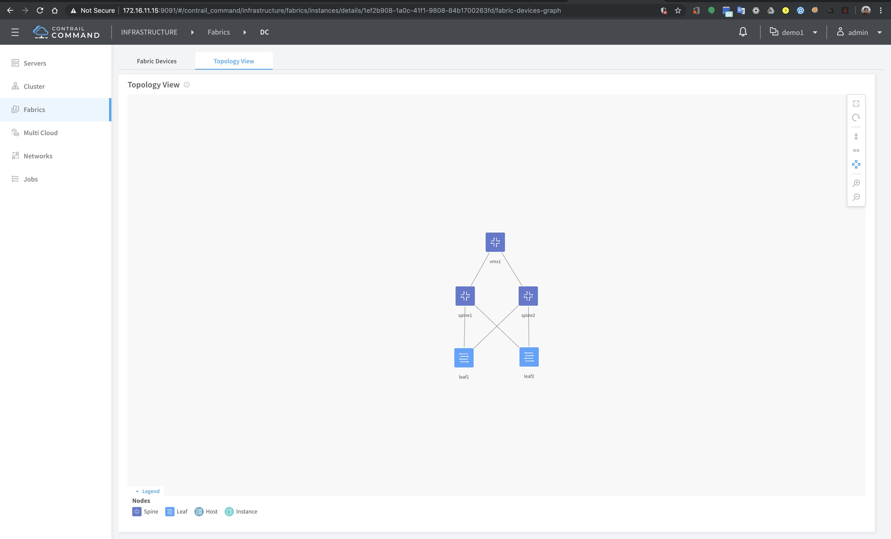
