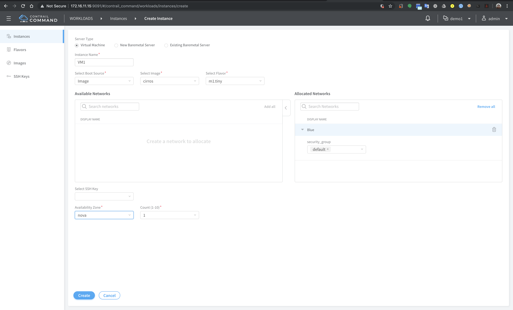
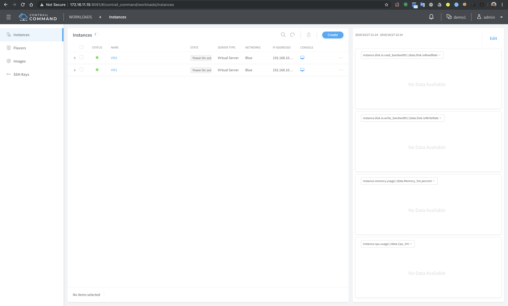

# Configuring virtual networks and virtual machine
In this lab exercise, virtual network will be created and virtual machines will be configured and attached to this virtual network

Steps
1. Access [contrail command dashboard](https://172.16.11.15:9091)
2. Select project `Demo1`

2. From menu, select `Overlay` > `Virtual Networks` and click `Create`
3. Create virtual network with the following parameters
    - name : Blue
    - subnet : 192.168.101.0/24

4. From menu, select `Workloads` > `Instances` and click `Create`
5. Create Virtual machine with the following parameters :
    - name : VM1
    - image : cirros
    - flavor : m1.tiny
    - allocated networks : Blue
    - security group : default
    - availability zone : nova

6. Create another VM with name `VM2`

7. Access console of `VM1` and verify that it can reach `VM2`

