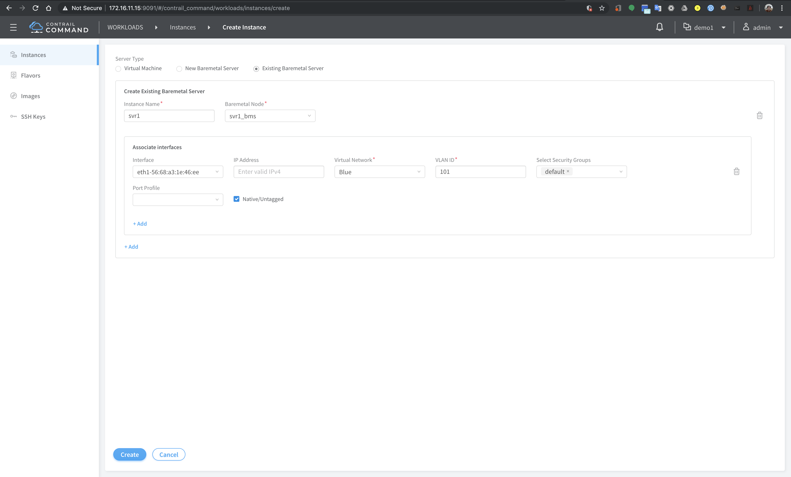

# Extending VN to TOR and attaching BMS
In this exercise, Virtual network will be extended to TOR Switch and BMS will be connected to the TOR switch

Steps
1. Access svr1 through its management interface, and record the mac address of port eth1

2. Access switch `leaf` and verify that there is no configuration for interface xe-0/0/2 (where the BMS SVR1 is connected to)

3. Access [contrail command dashboard](https://172.16.11.15:9091)
4. Select project `Demo1`
5. From menu, select `Infrastructure` > `Server` and click `create`
6. For the parameters, use the following :
	- choose mode : Detailed
	- workload type : Baremetal
	- name : svr1_bms
	- network interfaces:
		- name : eth1
		- mac address : <enter the mac address from step 1>
		- Device/TOR - Interface: leaf1 - xe-0/0/2 (based on the topology)
   Click `Create`


6. From menu, select `Workloads` > `Instances` and click `Create`
7. Create an instance with the following parameter
	- Server type : Existing Baremetal server
	- instance name : svr1
	- Baremetal node : svr1_bms (the one created on step 5)
	- Interface : XXX (select interface from svr1_bms)
	- Virtual network : Blue
	- VLAN ID : 101
	- security group : default
	- Native/untagged: checked
   Click `create`


8. From menu, select `Overlay` > `Security Group` and edit security group `Default`

9. For direction `ingress`, change `Type` from `Security group` to `CIDR` and click `Save`

10. Access switch `leaf` and verify that there is new configuration for interface xe-0/0/2 (where the BMS SVR1 is connected to)

11. Access `svr1` through its management interface, and create file /etc/sysconfig/network-scripts/ifcfg-eth1 with the following content :
	```
	BOOTPROTO=dhcp
	DEVICE=eth1
	ONBOOT=yes
	TYPE=Ethernet
	USERCTL=no
	```

12. On `svr1`, bring interface eth1 up, and verify that IP address from Virtual network Blue has been assigned to it

13. On `svr1, verify connectivity to `VM1` and `VM2`


