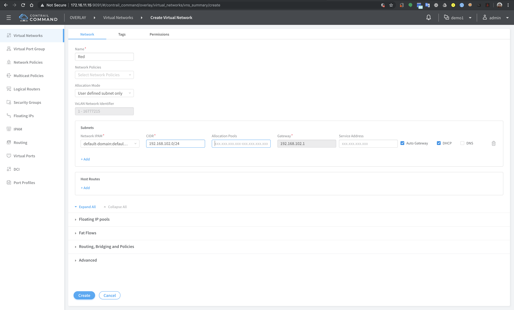
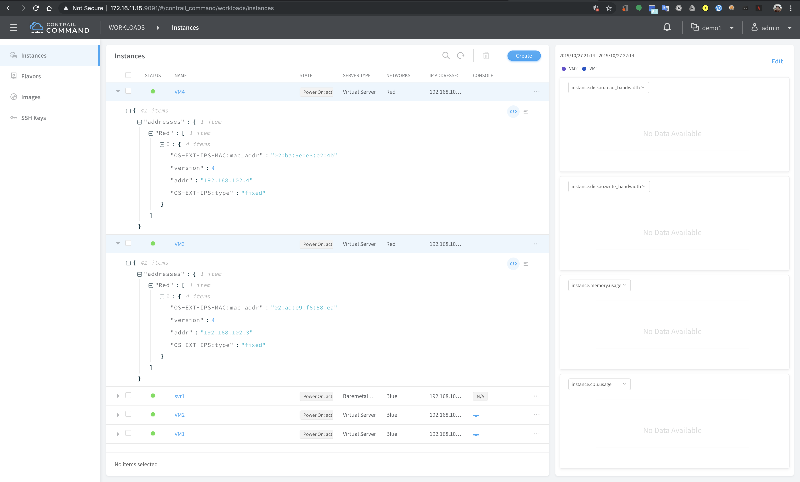
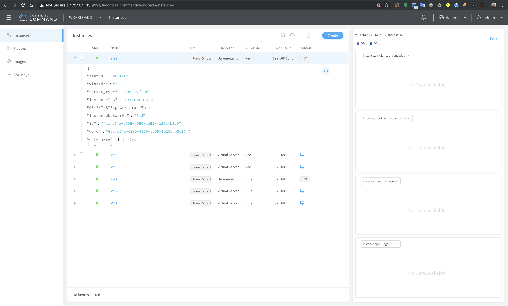
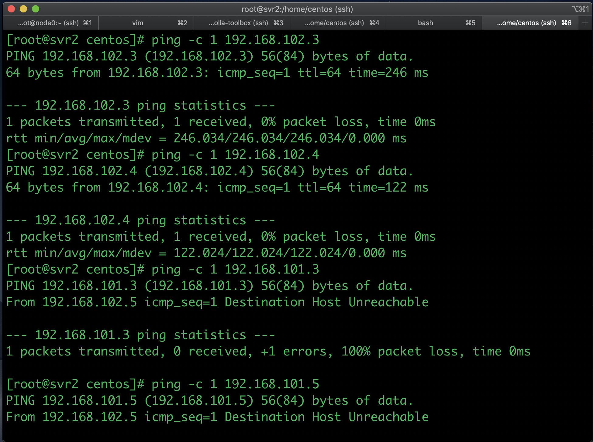
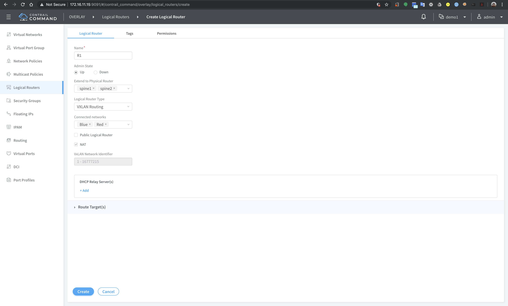
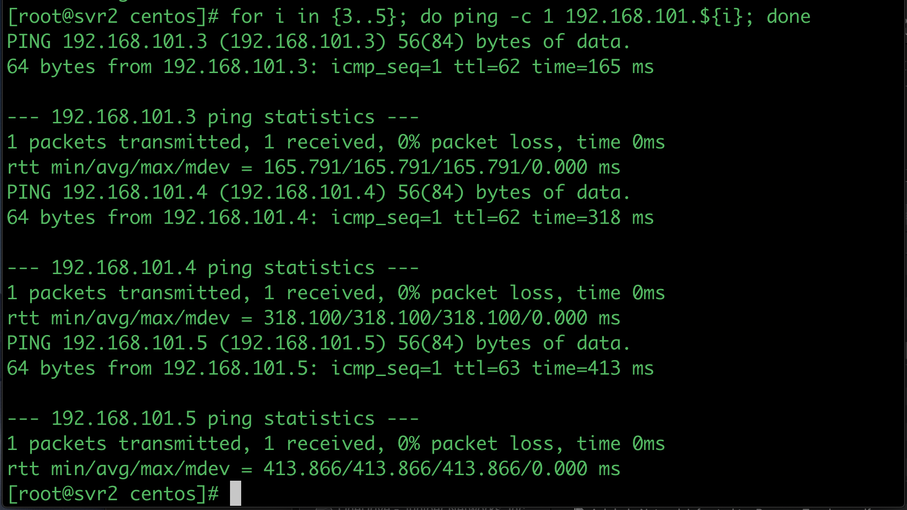
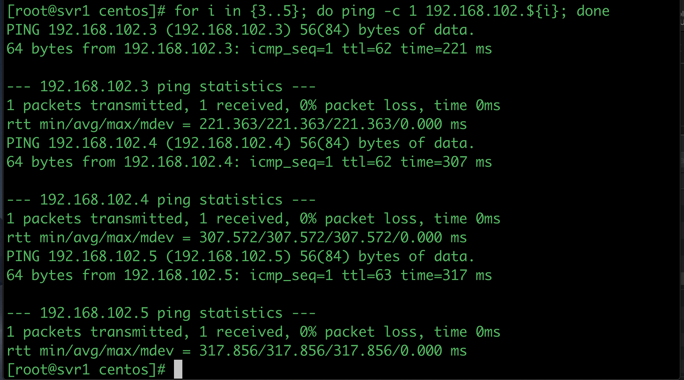

# Configuring InterVN routing
In this lab exercise, another virtual network, RED, will be created, and VMs and BMS will be attached to VM Red, then InterVN routing between VN Blue and RED will be configured.

Steps :
1. Access [contrail command dashboard](https://172.16.11.15:9091) 
2. Select project `Demo1`
3. Create VN Red with subnet 192.168.102.0/24

4. Create 2 VM (VM3 and VM4) and attached them to VN Red

5. Configure BMS `svr2` which is connected to port xe-0/0/2 of TOR Switch `leaf2`, where `svr2` is connected to VN Red with vlan tag 102

6. From `svr2`, verify that it can reach `VM3` and `VM4`, but not `VM1`, `VM2` or `svr1`

7. On Contrail Command Dashboard, from menu, select `Overlay` > `Logical Routers` and click `Create`
8. Create one logical router with the following parameters:
    - name : R1
    - Extend to physical router : spine1, spine2
    - logical router type : vxlan routing
    - connected networks : Blue, Red
   click `create`

9. Access spine1 or spine2 to verify that logical R1 has been created for VxLAN routing
10. From `svr2`, verify that it can reach `VM1`, `VM2` and `svr1`

11. From `svr1`, verify that it can reach `VM3`, `VM4` and `svr2`

