# Create Centos Image
The following steps is used to create VMM image from Centos Cloud Image.

## Few notes regarding Centos Cloud image :
- By default it doesn't have any password. During the first boot, cloud-init will try to retrieve the configuration (which may include password and ssh-key). In the openstack environment, cloud-init is provided by openstack infrastructure.
- If cloud-init failed to retrieve the configuration, the VM will boot with random password.
- Configuration to the cloud-init, can also be provided through CDROM image attached to the VM during the first boot. Inside the CDROM image must have the configuration files required by cloud init, including password. How to create this CDROM seed image can be found [here](https://stafwag.github.io/blog/blog/2019/03/03/howto-use-centos-cloud-images-with-cloud-init/) 
- To simplify the process, I have created the seed [CDROM image](https://github.com/m1r24n/running_on_vmm/blob/master/cdrom/seed.img), where the password for default user (userid : centos) is set to `mysecret`

## Steps
1. Download Centos cloud Image from [centos image](https://cloud.centos.org/centos/7/images/)
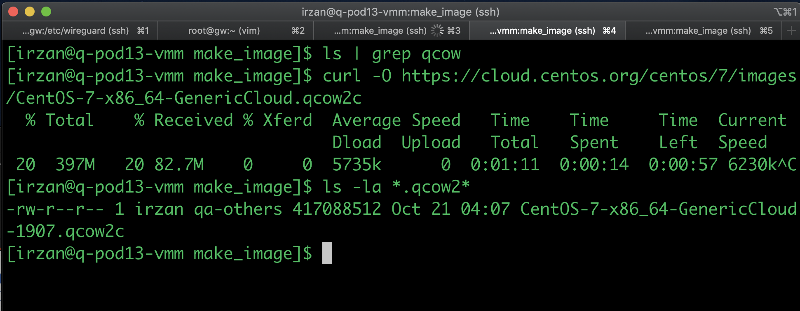
2. Copy the files to file with new name, for example `centos80g.img` and resize the image accordingly
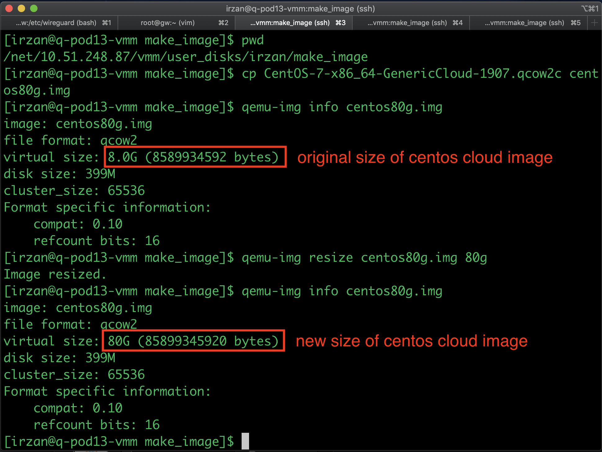
3. By default, the centos cloud image size is 8G, to change the size, use the command `qemu-img resize <image_file> <new_size>`
4. Download the [seed cdrom image](https://github.com/m1r24n/running_on_vmm/blob/master/cdrom/seed.img), and put it on the same directory as the previous image. 
4. Create VMM configuration file, with the following content :
```
	[irzan@q-pod13-vmm make_image]$ cat centosmake.conf
	#include "/vmm/bin/common.defs"
	#define INSTALL_DISK bootdisk_rw "/vmm/data/user_disks/irzan/make_image/centos80g.img";
	#define CDROM_BOOT cdrom_boot "/vmm/data/user_disks/irzan/make_image/seed.img";
	config "make1" {
		vm "centos1" {
			hostname "centos1";
			INSTALL_DISK
			CDROM_BOOT
			ncpus 2;
			memory 4096;
			setvar "+qemu_args" "-cpu qemu64,+vmx";
			interface "em0" { bridge "private1"; };
		};

		PRIVATE_BRIDGES
	};

	[irzan@q-pod13-vmm make_image]$
```
5. Enable the config and start the topology
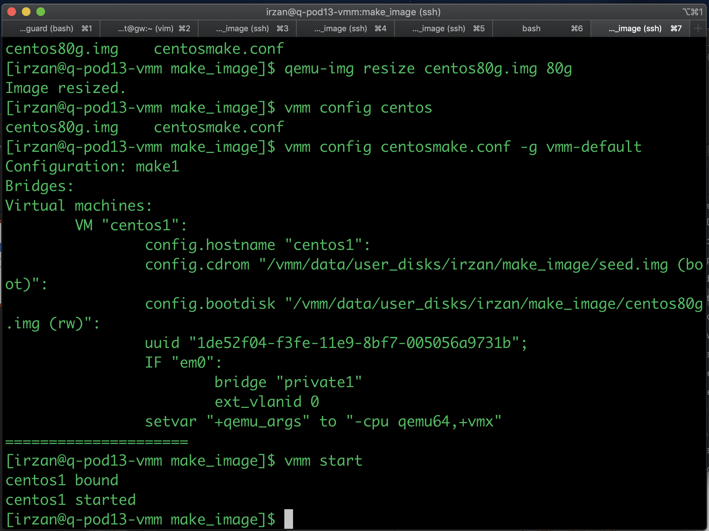
6. Get the serial and vga_display information of the VM, to access the console
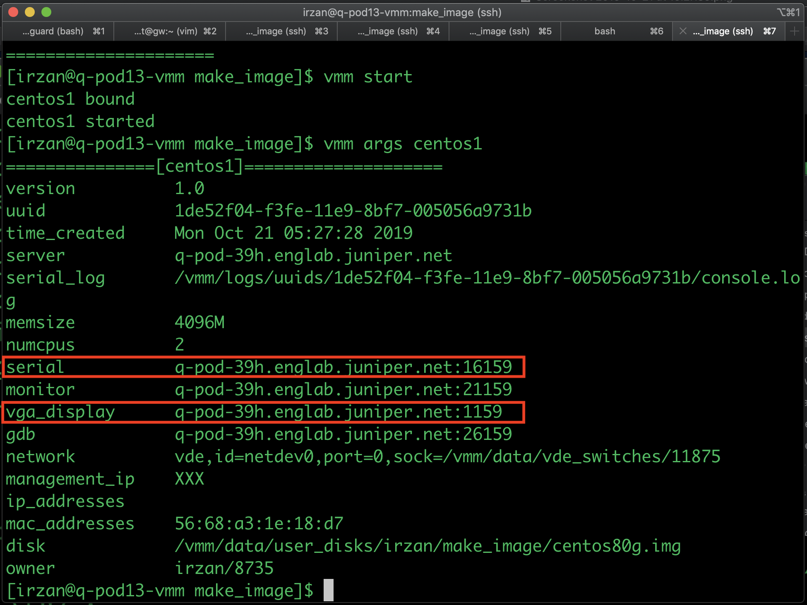
7. Access the serial console, and you may have since there is no dhcp server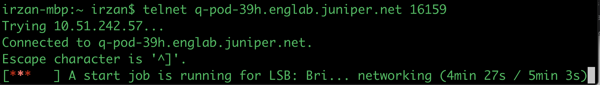
8. Once the booting process is done, you can login into the system using username/password : centos/mysecret
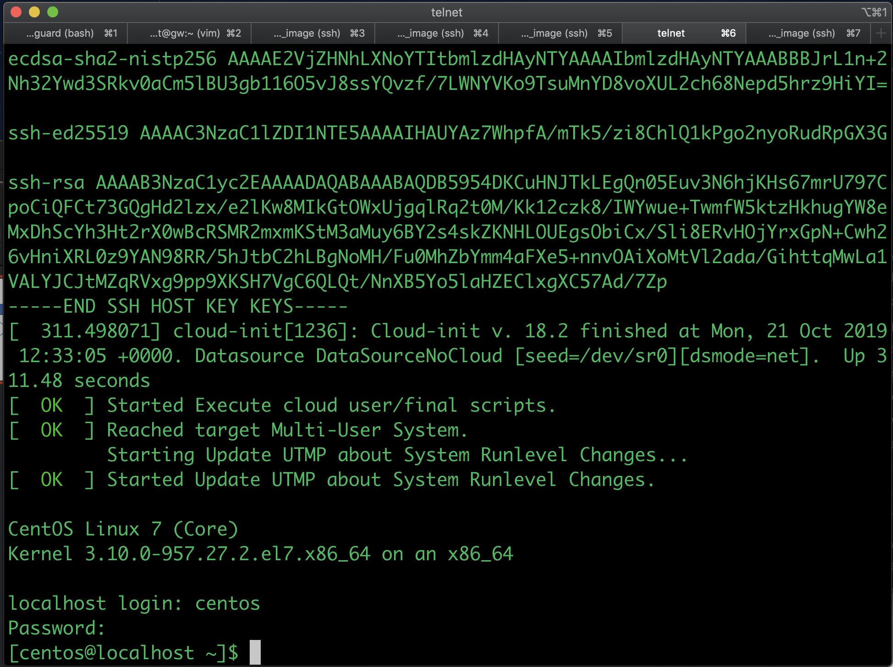
9. Do `sudo bash` to access as admin user the do the following
- change the password for user `centos`
- change the password for user `root`
- remove `cloud-init` application from the system
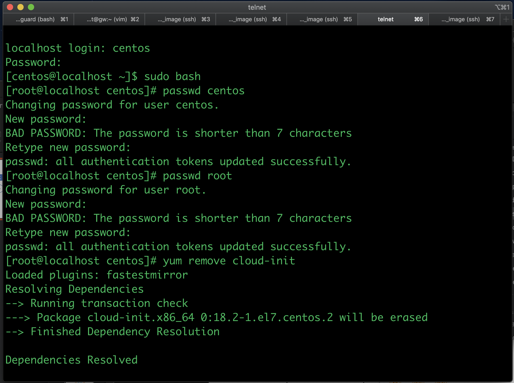
10. On centos7, a new naming scheme for network interface is introduced. Instead of using `eth`, it uses the driver name for the network interface name.
11. To revert back to the legacy naming of interfaces like `eth0`, `eth1`, `eth2`, etc, then additional parameter need to be added during kernel boot process, and this is done by modifying the grub configuration file which will be read during the boot-up process.
12. Edit file /etc/default/grub and add net.ifnames=0 biosdevname=0 to line GRUB_CMDLINE_LINUX
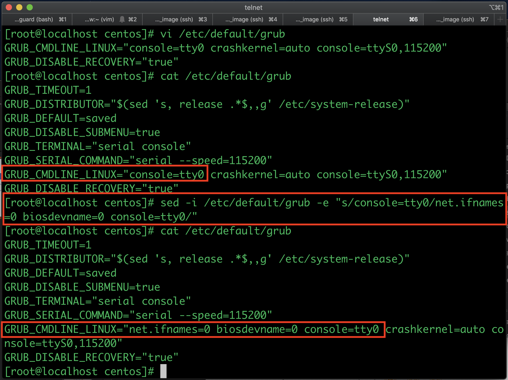
13. Run command `grub2-mkconfig` to generate new grub configuration file
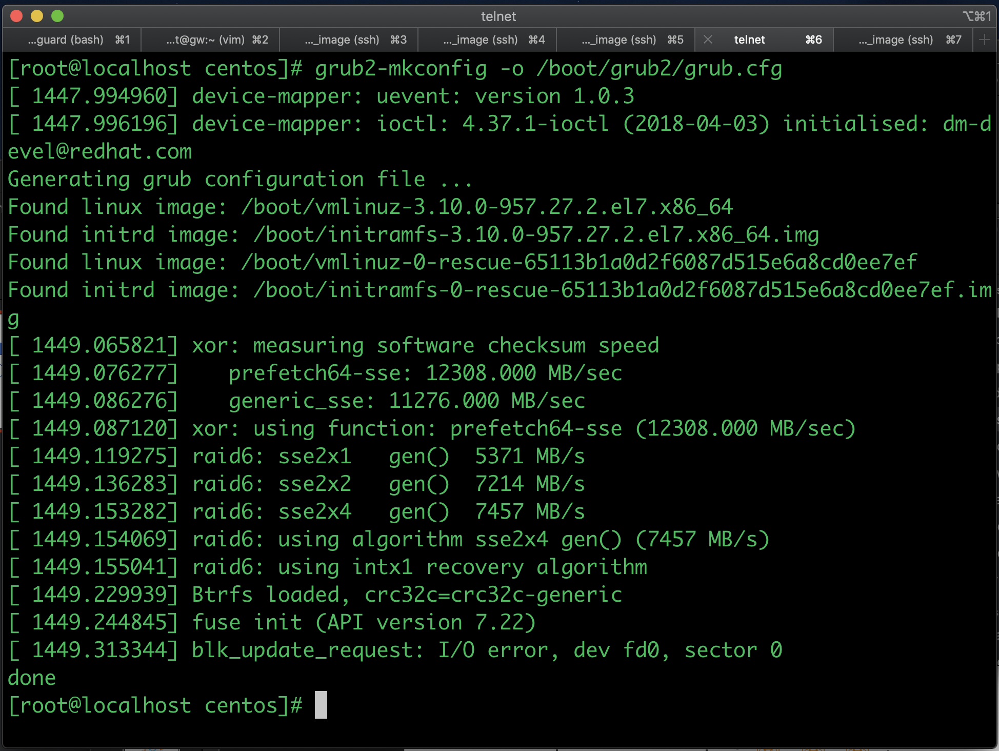
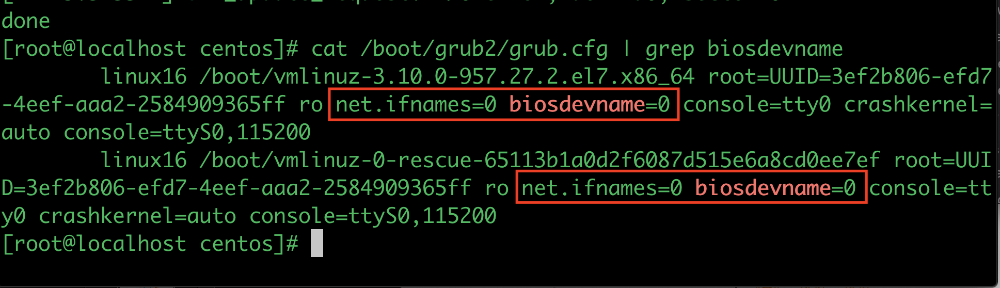
14. Shutdown the VM , stop and unbind it on the VMM
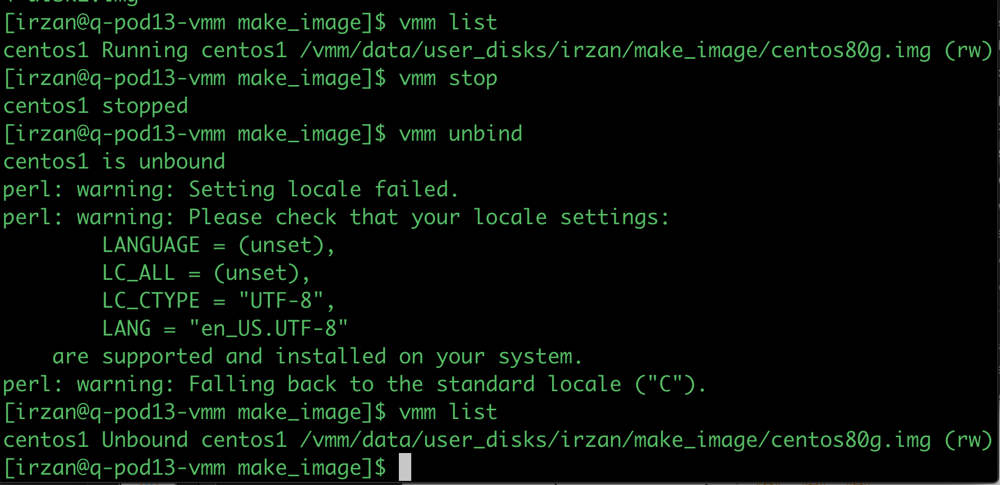
15. Move the image file into your repository so it can be used 
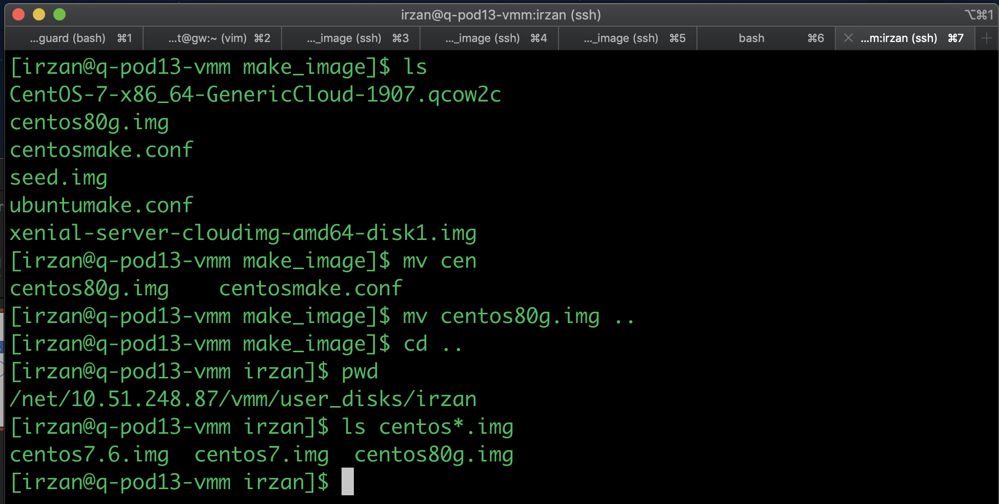
