# How to install wireguard on VMM

## Installation 
1. Follow the instruction available from wireguard [web page](https://www.wireguard.com/install/)

The following are the screenshot
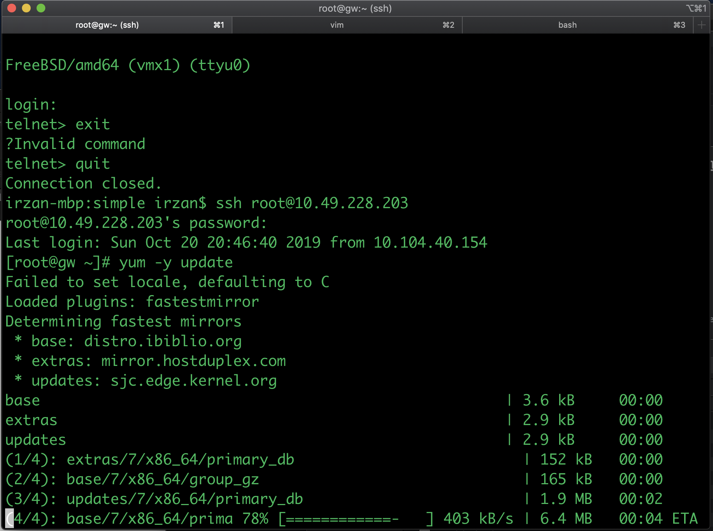
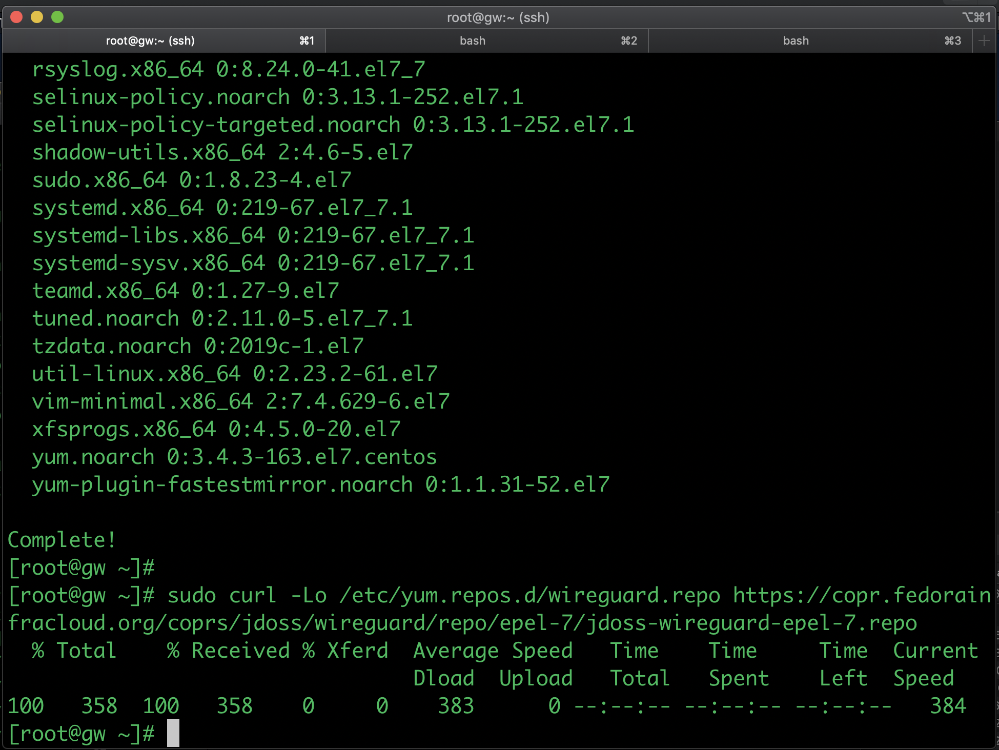
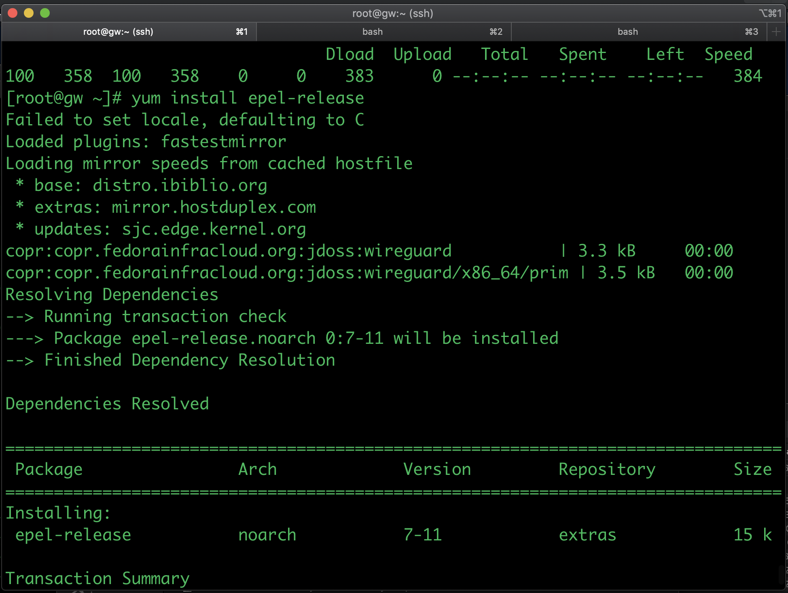
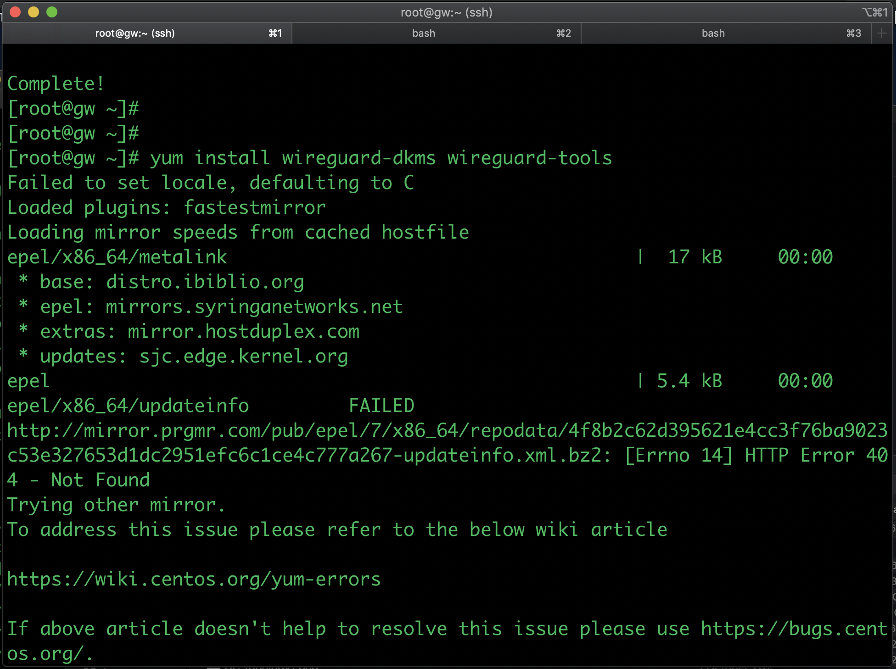

2. On the GW, create the public and private key for GW.

The instruction is avalailable from wireguard [web page](https://www.wireguard.com/quickstart/)

The following are the screeshot

3. Create private and public key for GW

4. Create private and public key for remote client (in this case for my macbook)
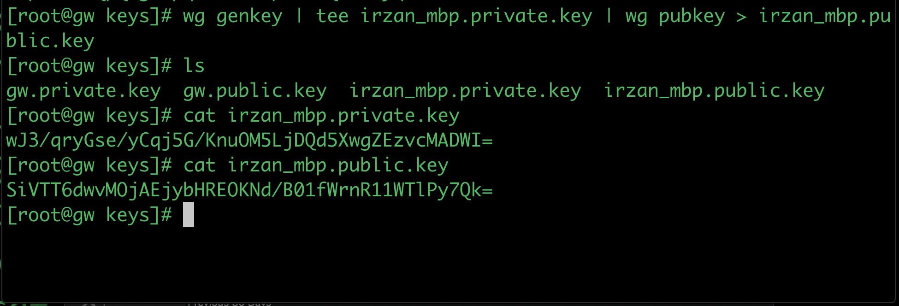
5. Create configuration files for GW (server)
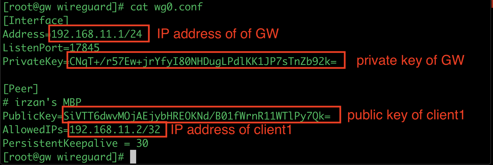
6. Change the /etc/wireguard directory to be accessible only by root
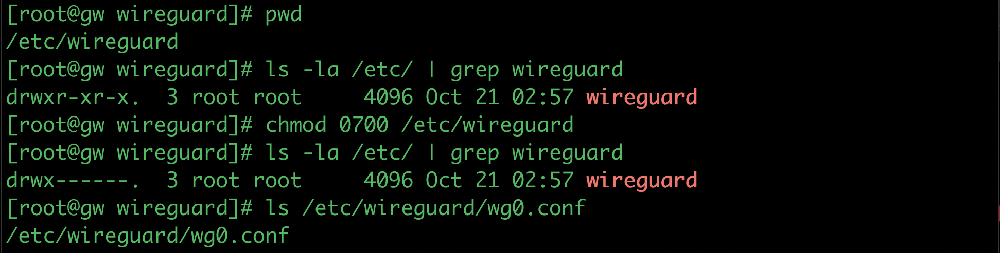
7. Start the wireguard services on GW, and optionally make it permanent.
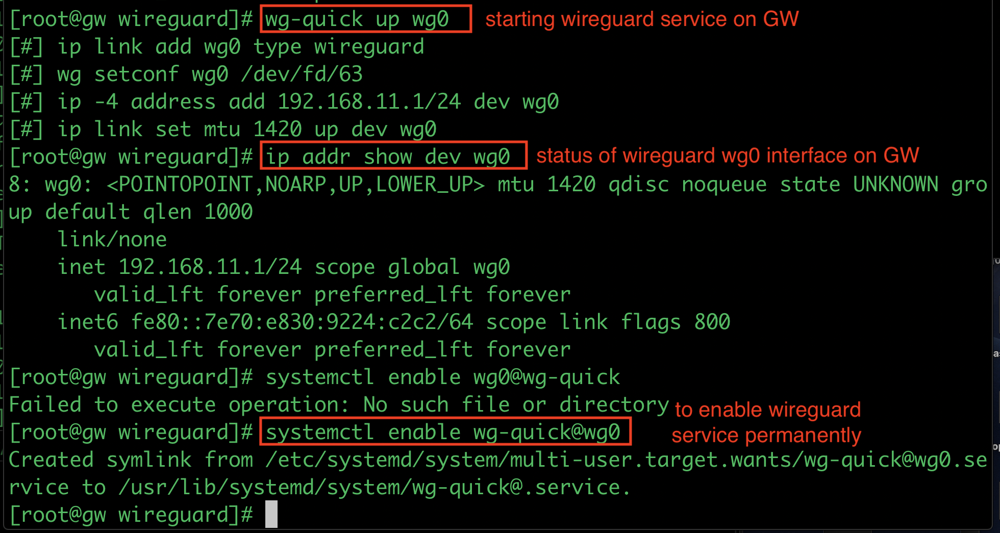
8. Create configuration for client and import it into client's software
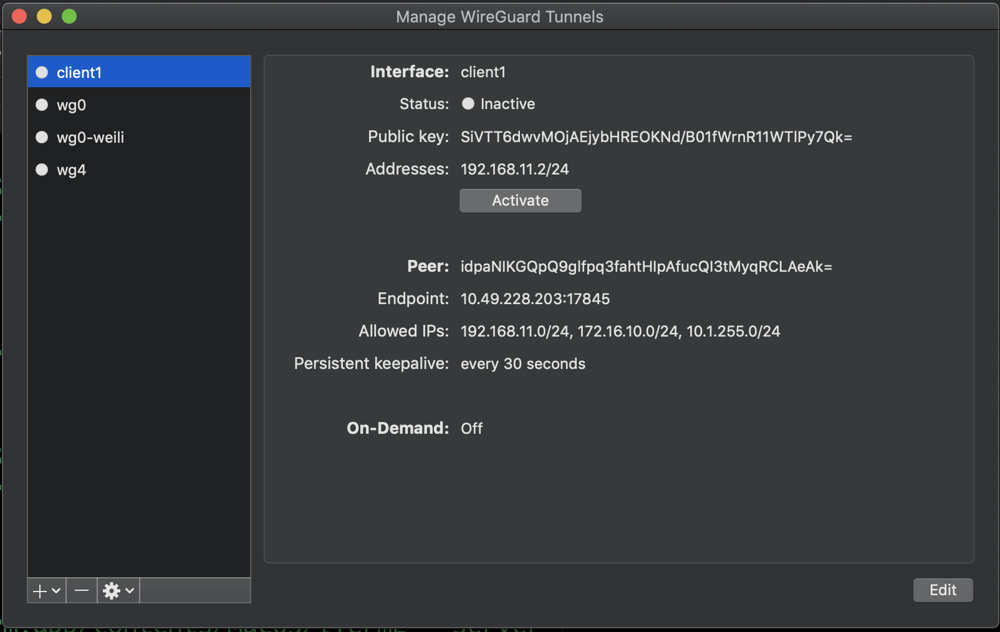
9. Activate the connection and verify that  connection is established
Before client is activated
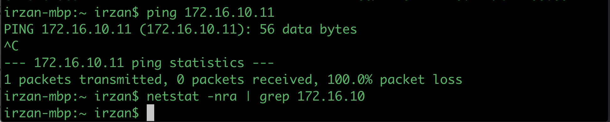
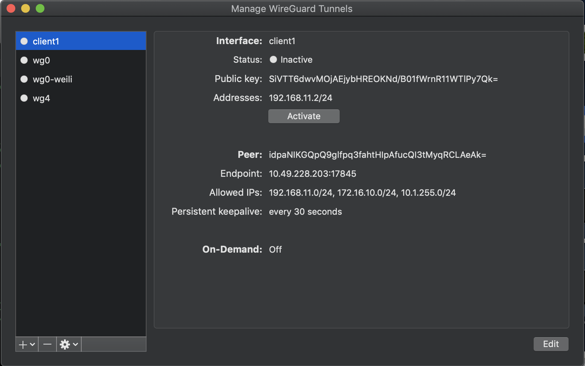
Client is activated
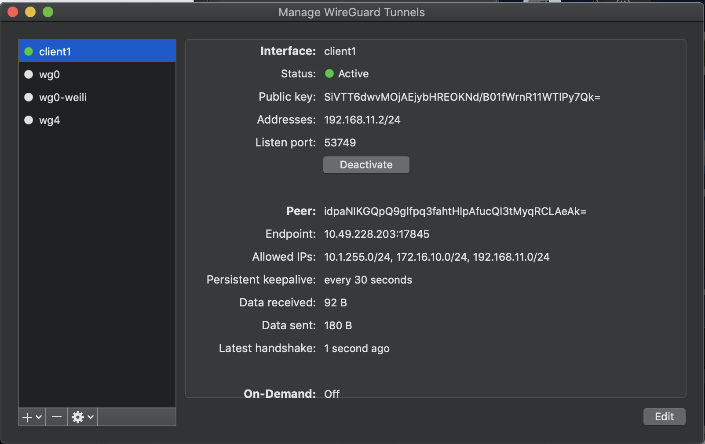
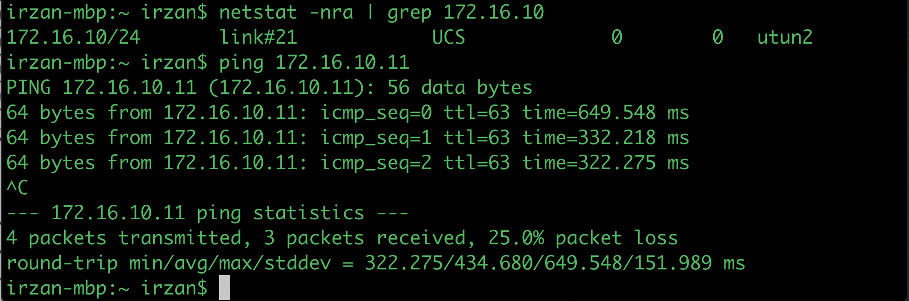

