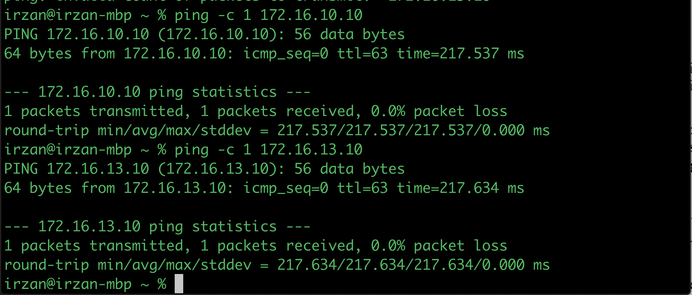
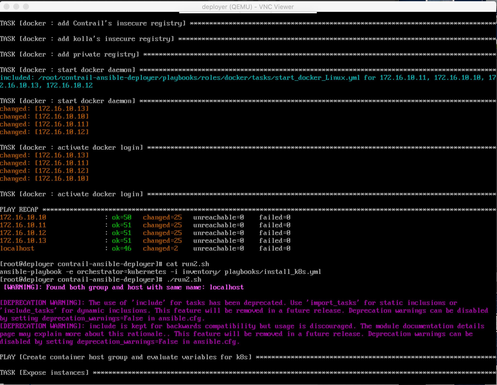

# Installing kubernetes with Contrail in VMM
This document provides information on how to install kubernetes and Contrail in the VMM environment.

## Topology
The logical topology of the testbed is as follows :


The devices/nodes in the topology are :

1. GW
    - gateway between juniper's intranet and testbed network
2. Contrail nodes 
    - node0 : k8s mater /Contrail contoller
    - node1 : k8s node
    - node2 : k8s node
    - node3 : k8s node
    - node4 : NFS server
    - deployer : ansible deployer
    - cc : contrail command
3. DC Fabric
    - VMX : DCGW

subnets in the testbed
- lan0 : 172.16.10.0/24
- lan1 : 172.16.11.0/24
- lan2 : 172.16.12.0/24
- lan3 : 172.16.13.0/24
- management: 172.16.100.0/24

## Setup the testbed
1. Create yaml file for the lab topology, or you can use the following [lab.yaml](lab.yaml)
2. Create the topology using this [script](https://github.com/m1r24n/running_on_vmm) to create the configuration files and upload them into the VMM pod


3. Start the topology using the same script

4. Record the IP address of GW assigned by VMM

5. edit the following file [ssh_config](ssh_config), replace the vmmgw hostname with the ip address of the gateway from previous step, and add this file into your home ssh's config 


5. Wait for few minutes to allow the VMs to be up and running
6. SSH into GW and verify that all nodes are up and running

7. (optionally) install wireguard to have direct access to node from your workstation. Follow this [instruction](https://github.com/m1r24n/running_on_vmm/tree/master/install_wg_on_vmm) on how to install wireguard on VM inside the VMM.
8. Establish VPN connection from your workstation to GW


9. Test direct access into the nodes from your workstation


## Initial nodes configuration 
1. Access deployer and verify the following this node
    - all the other node (node0 to node4) are accessible
    - file /etc/hosts has entries for all nodes and devices in the testbed, especially contrail nodes. If deployer node doesn't have it, then copy the following into /etc/hosts
    ```
    127.0.0.1       localhost.localdomain localhost
	::1             localhost6.localdomain6 localhost6
	172.16.10.1     gw
	172.16.10.10    node0
	172.16.10.11    node1
	172.16.10.12    node2
	172.16.10.13    node3
	172.16.10.14    node4
    ```
2. create ssh-key on deployer node

3. copy the ssh-key to node0 .. node4 to allow passwordless ssh access from node6 
	command to copy ssh-key

```
	for i in {0..4}
	do
		ssh-copy-id -i ~/.ssh/id_rsa.pub root@node${i}
	done
```

## kubernetes and Contrail installation using ansible deployer
1. For the latest version of contrail, please follow the [manual](https://www.juniper.net/documentation/en_US/contrail19/topics/task/installation/provisioning-k8s-cluster.html)

```
		yum -y install epel-release git ansible net-tools
```


2. Upload the ansible deployer file into deployer and unzip the file
3. Upload this file [instances.yaml](contrail_config/instances.yaml) to deployer, and put it inside directory `contrail-ansible-deployer/config


4. Get the vga_port of VM deployer, and use this information (host and port number) to open VNC session to the console of deployer (using this method to run the playbooks, allow you to disconnect remote access session, and leave the playbook run until it finish). It may take 30 to 60 minutes to install.


5. Enter contrail-ansible-deployer directory, and start the following command :
    - ansible-playbook -i inventory/ -e orchestrator=kubernetes playbooks/configure_instances.yml

6. Run the following command :
    - ansible-playbook -e orchestrator=kubernetes -i inventory/ playbooks/install_k8s.yml

7. Run the following command :
    - ansible-playbook -i inventory/ -e orchestrator=kubernetes playbooks/install_contrail.yml

8. Contrail installation is done. It can be verified by accessing the kubectl on node0 (172.16.10.10) or contrail dashboard (http://172.16.10.10:8180) or run the command `contrail-status` on any of the contrail-nodes (controller or k8s nodes)
9. Now the installation of openstack, contrail networking, appformix and contrail command is done. You can start playing around with it or you can use the following [lab exercise](contrail_k8s_lab_exercise/)

