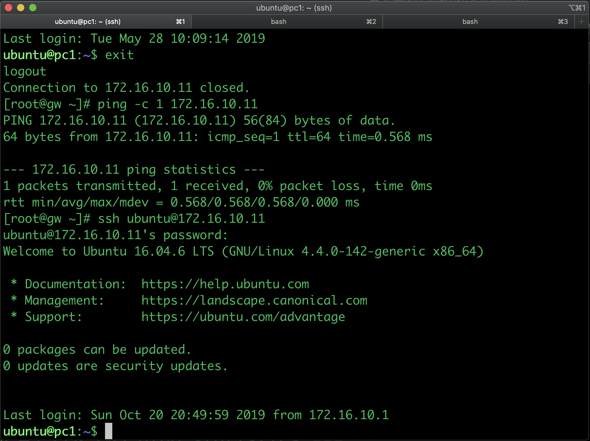

# Simple topology on VMM
# Overview
This is an example of simple topology on VMM, consist of the following
- 2 x vMX
- 2 x vQFX
- 4 x PC 

# Topology

Steps to configure
1. Create the [lab.yaml](lab.yaml) for this topology. Verify the following :
    - VMM Pod servers
    - user/password to login into VMM pod
    - user/password for junos devices
    - IP address for management on every devices
2. Verify that the images for the VM are in the working directory of VMM (`/vmm/data/user_disks/<username>/`)

3. Run the script to upload the configuration files into VMM pod (`vmm.py upload`)

4. Run the script to start the VMs in the VMM pod (`vmm.py start`)

5. Ping the ip address of the jump host, to verify that the topology is up and running and test to access the jump host using ssh

6. for Centos, the login (user/password) are :
- centos/pass01
- root/pass01
7. for Ubuntu, the login (user/password) is :
- ubuntu/pass01
8. From the jump host, try to access other devices in the topology

9. The serial console information for each devices can be displayed using command `vmm get_serial`

10. Now you can play around with the topology by uploading or configuring the devices
11. optionally, wireguard VPN can be installed on GW, to allow direct access into the devices. Please refer to this [install wireguard on vmm](https://github.com/m1r24n/running_on_vmm/install_wg_on_vmm/README.md) on HOW-TO document
